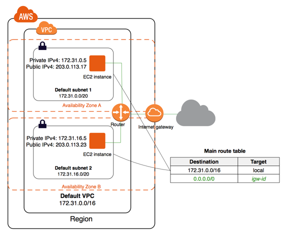

1. AWSの概要と導入のメリット
    1. サーバの仕組みと選ぶポイント
        - 서버는 여러가지 의미
        - 웹서버는 http프로토콜을 사용하고 있어서 http서버라고 부름
        - 서버/클라이언트가 있음
        - 클라이언트 -> 리퀘스트 -> 서버
        - 클라이언트 <- 레스폰스 <- 서버
        - 
    2. AWSの概要
        - IT를 실현하기 위해 필요한 서비스 집약
        - 글로벌
            - 세계 각지에 리전이 있고, 여러개의 데이터센터 존재
    
    3．AWSを導入するメリットについて
    

2．AWSの基本を理解してコスト削減を検討する
    1．プラットフォーム、サービスについて
    2．クローバるな
    3．네트워킹
    4. 컴퓨팅
    5. 스토리지
    6. 데이터베이스 

    
> 출처 
> AWS 설명서 : https://docs.aws.amazon.com/index.html?nc2=h_ql_doc_do_v
> 생활코딩 AWS : https://opentutorials.org/course/608/3005


1. 컴퓨팅
    1. EC2
        1. 정의
            - Amazon Elastic Compute Cloud
        2. 기능
            1. 인스턴스
                - 기본이 아닌 VPC에서 시작한 인스턴스에는 프라이빗 IPv4 주소가 있음
                  해당하는 서브넷의 퍼블릭 IP 주소 속성을 수정하지 않으면 퍼블릭 IPv4 주소는 없음
                 
               - 인스턴스의 기본 유저는 AMI에 의해서 결정됨 
               
            2. AMI
                1. 개념
                    - 인스턴스 시작시 필요 정보 제공
                    - 1개 이상의 EBS 스냅샷이나, 인스턴스 저장 지원 AMI의 경우 인스턴스의 루트 볼륨에 대한 템플릿을 포함
                    - AMI를 사용하여 인스턴스를 시작할 수 있는 AWS 계정을 제어하는 시작 권한
                    - 시작될 때 인스턴스에 연결할 볼륨을 지정하는 블록 디바이스 매핑
                      
                    - AMI는 구입, 공유, 판매가 가능
                2. AMI 생성
                    - https://docs.aws.amazon.com/ko_kr/toolkit-for-visual-studio/latest/user-guide/tkv-create-ami-from-instance.html
            3. EBS
                - Elastic Block Store
                - 일종의 하드디스크
                - 사용한만큼 과금되는 종량제
                - 내부적으로 데이터를 실시간 복제하고 있기 때문에 데이터를 잃어버릴 확률이 낮음
                - 스냅샷 기능을 제공하여 현재 상태 그대로 보존 가능
                - 인스턴스를 제거해도 EBS는 독립적이기 때문에 데이터 유지됨
                - Volume : EBS로 생성한 디스크 하나하나를 볼륨이라고 부름
                - EC2 인스턴스에 볼륨을 붙이고 인식하는 방법 링크 https://opentutorials.org/course/608/3005
      
2. 스토리지
    1. S3
        1. 개념
            - 인터넷용 스토리지 서비스
            - 웹을 통해 언제 어디서나 원하는 양의 데이터를 저장하고 검색 가능  
        2. 버킷
                버킷은 객체의 컨테이너
                각 버킷에 대해 액세스 권한 제어 가능
                S3는 데이터를 버킷 내에 객체로 저장함 -> 즉 저장할 파일을 버킷에 업로드 해야함
                객체는 파일과 해당 파일을 설명하는 메타데이터(선택)으로 구성됨
                버킷의 지리적 리전 선택 가능
        
    2. S3 Glacier
        1. 개념
            - 자주 사용되지 않는 데이터 즉, 콜드 데이터에 최적화된 스토리지 서비스
            - 매우 저렴한 가격에 데이터 보관, 백업을 보안 기능과 함께 제공하는 스토리지 서비스
            - 장기간 효율적인 비용으로 저장 가능
        2. 데이터 모델
            1. 볼트
                - 아카이브 보관용 컨테이너
            2. 아카이브
                S3 Glacier의 기본 스토리지 단위  
                사진, 동영상, 문서 등 모든 데이터 가능  
                각 아카이브는 고유 ID를 가짐(리전에서 고유)  
                
    
3. 데이터베이스
    1. RDS
        1. 개념
            - Amazon Relational Database Service
            - AWS 클라우드에서 관계형 데이터베이스를 더 쉽게 설치, 운영, 확장할 수 있는 웹서비스
            - MySQL, MariaDB, PostgreSQL, Oracle 및 Microsoft SQL Server 사용가능
        2. DB 인스턴스
            - RDS의 기본 빌딩 블록
            - AWS 클라우드에 있는 격리된 데이터베이스 환경
            - 사용자가 만든 여러 개의 데이터베이스가 포함될 수 있음
            - DB엔진을 실행
    2. ElastiCache
        1. 개념
            - 클라우드에서 분산된 인 메모리 데이터 스토어 또는 캐시 환경을 손쉽게 설정, 관리 및 확장할 수 있는 웹 서비스
            - Redis와 Memcached 지원
            - ElastiCache 이해
                 
            > Reference
            > https://aws.amazon.com/ko/elasticache/redis/
            
4. 개발자도구
    1. Cloud9
    
5. 보안 자격 증명 및 규정 준수
    1. WAF
        1. WAF란?
            - Web Application Firewall
            - CloudFront, API Gateway, LoadBalancer에 전달되는 HTTP(S)요청을 모니터링 할 수 있게 해주는 웹 어플리케이션 방화벽
            - 억세스를 금지 해야하는 경우에 403코드로 응답
    2. IAM
        1. IAM이란?
            - Identity and Access Management
            - 리소스를 사용하도록 인증(로그인) 및 권한 부여(권한 있음)된 대상을 제어
        2. IAM 기능
            - 암호나 액세스 키를 공유하지 않고도 계정의 리소스를 관리하고 사용하는 권한 줄 수 있음
            - 권한을 다양하게 부여 가능 (읽기 전용, 결제정보 액세스 불가 등)
            - 무료 사용
        3. IAM 용어
            - 리소스 : IAM에 저장된 사용자, 그룹, 정책 및 자격 증명 공급자 객체
            - ID : 식별 및 그룹화에 사용되는 IAM 리소스 객체
            - 개체 : AWS가 인증에 사용하는 IAM 리소스 객체
            - 보안 주체
        4. 자격증명
            1. 루트 계정(Root)
                계정을 처음 생성하는 경우
                전체 AWS 서비스 및 계정 리소스에 대해 완전한 액세스 권한을 가짐
                계정을 생성할때 사용한 이메일 주소와 암호로 로그인
                일반적인 작업에 사용하지 않는 것을 추천 -> 무제한적인 접근 권한을 가지고 있으므로 이러한 권한을 제어하는 것이 불가능
                처음 시작시에만 루트 계정을 사용하고 그 이후에는 사용자를 생성하는 것을 추천
            2. IAM 사용자(User)
                AWS에서 만드는 엔티티
                사용자 이름, 암호, 액세스키로 이루어짐
                적절한 권한 정책이 있는 그룹의 구성원으로 만드는 것을 추천
            3. IAM 그룹(Group)
                IAM사용자들의 집합(User Group)
                권한을 지정하여 놓으므로 사용자를 그룹에 포함시키면 자동적으로 지정된 권한들을 부여함
            4. IAM 역할(Role)
                특정 권한을 가진 계정에 생성할 수 있는 IAM 자격 증명
                권한의 논리적 집합(권한의 Group)
                역할을 만들고 역할을 그룹이나 사용자에 연결
                많이 쓰임
            5. 임시 자격 증명
                일반 IAM 사용자보다 제한된 권한을 갖는 임시 자격 증명
                허용되지 않는 작업을 뜻하지 않게 수행하는 일을 막을 수 있음
                설정 기한이 지나면 자동으로 만료됨
                유효기간을 통제할 수 있음

> Reference
> IAM 자격증명 : https://musma.github.io/2019/11/05/about-aws-iam-policy.html#aws-iam%EC%9D%80-%EB%B0%98%EB%93%9C%EC%8B%9C-%EA%B3%B5%EB%B6%80%ED%95%98%EC%9E%90
> https://www.44bits.io/ko/post/first_actions_for_setting_secure_account
> https://acstory.tistory.com/15

6. 암호화 및 PKI
7. 머신러닝
8. 관리 및 거버넌스
    1. Auto Scaling
    2. Cloud Watch
9. 마이그레이션 및 전송
10. 모바일
11. 네트워크 및 콘텐츠 전송
    1. API Gateway
    2. Cloud Front
        1. 개념
            - html, css, js, 이미지 파일과 같은 정적 및 동적 웹컨텐츠를 사용자에게 더 빨리 배포하도록 지원하는 서비스
            - 사용자가 요청하면 지연시간이 가장 낮은 엣지 위치라고 하는 데이터센터로 라우팅 되서 컨텐츠 전송
            - 콘텐츠가 이미 지연시간이 가장 낮은 엣지에 있는 경우 클라우드 프론트가 컨텐츠를 즉시 제공함
            - 지연시간이 가장 낮은 엣지에 없는 경우 컨텐츠의 최종 버전에 대한 소스로 지정된 오리진에서 컨텐츠를 검색하여 제공
            - 파일의 사본이 전 세계 여러 엣지 로케이션에 유지되므로 안정성 향상
             
    3. Route 53
    4. VPC
        1. VPC 개념
            - Amazon Virtual Private Cloud
            - EC2의 네트워크 계층
            - AWS 계정 전용 가상 네트워크
            - 계정당 기본 VPC가 제공됨
            1. 서브넷
                - VPC의 IP주소 범위
                - 퍼블릭 서브넷 : 인터넷에 연결되어야 하는 리소스
                  프라이빗 서브넷 : 인터넷에 연결되지 않는 리소스
                - 기본 VPC의 기본 서브넷은 퍼블릭 서브넷
            2. 라우팅 테이블
                - 네트워크 트래픽을 전달할 위치를 결정하는데 사용되는 라우팅이라는 규칙 집합이 포함되어 있음
            3. 인터넷 게이트웨이
                - VPC의 인스턴스와 인터넷 간에 통신할 수 있게 해주는 역할
            4. 엔드포인트
                - 엔드포인트를 통해 VPN 같은 서비스를 필요로 하지 않음
                - PrivateLink를 지원하는 AWS 서비스 및 VPC 엔드포인트 서비스에 비공개로 연결 가능
    5. VPN
    6. Elastic Load Balancing
12. 미디어 서비스
13. 최종 사용자 컴퓨팅
14. 분석
    1. Elasticsearch Service
        1. 개념
            - AWS에서 ElasticSearch 클러스터를 쉽게 배포, 운영, 조정 할 수 있는 관리형 서비스
            - Amazon ES를 사용하면 Elasticsearch API에 바로 액세스해 기존 코드 및 애플리케이션을 서비스를 통해 원활하게 사용할 수 있음
            - Amazon ES 도메인 = Elasticsearch 클러스터
            - 도메인은 설정, 인스턴스 유형, 인스턴스 수, 스토리지 리소스를 지정한 설정
        2. Elasticsearch란
            - 로그 분석, 실시간 애플리케이션 모니터링, 클릭 스트림 분석 같은 사용 사례를 위한 오픈 소스 검색 및 분석 엔진
            - 아파치 루씬 기반
            - 자바 오픈소스 분산 검색 엔진
            - 방대한 양의 데이터를 신속하게 거의 실시간으로 저장, 검색, 분석 가능
            - 관계형 데이터 베이스와의 비교
                DataBase = Index
                Table = Type
                Column = Field
                Row = Document    
            - 아키텍쳐
                    
                - Cluster
                    - 엘라스틱서치에서 가장 큰 시스템 단위
                    - 최소 하나 이상의 노드로 이루어진 노드들의 집합
                    - 서로 다른 클러스터는 데이터 교환, 접근 못함 -> 독립적 구조
                    - 여러대의 서버가 하나의 클러스터를 구성할 수도 있고, 한 서버에 여러개의 클러스터가 존재할 수도 있음
                - Node
                    - 엘라스틱서치를 구성하는 하나의 단위 프로세스
                    - Master-eligible, Data, Ingest, Tribe 
                - Index
                    - 
                - Shard
                    - 데이터를 분산해서 저장하는 방법
                - Replica
                    - 샤드들을 복제하는 것
                    - 레플리카는 서로 다른 노드에 존재할 것을 권장함
                    

```
Elasticsearch https://victorydntmd.tistory.com/308
```

15. 애플리케이션 통합
16. 비즈니스 애플리케이션
17. Satellite
18. 로봇공학
19. 블록체인
20. 게임개발
21. 사물인터넷
22. 고객 참여 서비스
23. 고객 참여
24. 증가아현실 및 가상현실
25. SDK 및 도구 키트
26. 일반 참조
27. AWS Management Console
28. 추가 리소스