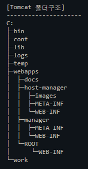
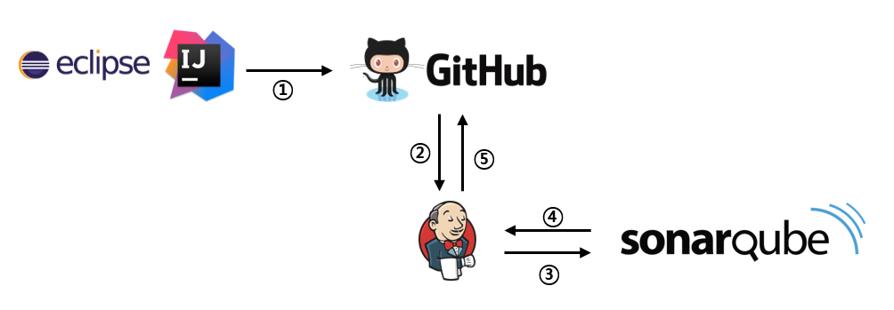

1. 정의
    - 지속적 통합
    - 지속적으로 퀄리티 컨트롤을 적용하는 프로세스를 실행하는 것
    - 소프트웨어 개발 프로젝트는 [분석/설계] → [코드 작성] → [빌드] → [테스트] → [릴리스] → [디플로이]의 생명주기를 가짐
    - 위의 단계들이 반복적으로 이루어지는데 예전에는 이 과정에서 복잡성 및 시간 소요로 통합이 드물게 이루어졌음
    - 이러한 문제를 해결하기 위해 팀원들이 작성한 코드를 최대한 자주 통합하는 소프트웨어 개발 실천법이 지속적인 통합임                        
    1. 생명주기
        - Compile
            - 컴퓨터가 이해하는 기계어로 변환하는 작업 즉, 바이너리 코드로 변환
            - 이러한 작업을 하는 것을 컴파일러
            - 자바의 경우 컴파일러가 바이트코드 형태의 클래스 파일을 생성하면 JVM에서 실행
            - 컴파일은 해당 파일만을 컴파일해서 object 파일을 생성
        - Build
            - 소스코드 파일을 실행가능한 소프트웨어 산출물로 만드는 일련의 과정을 말함
            - 빌드 안에 컴파일이 포함되어 있음
            - 자바의 경우 war, jar 파일을 만드는 것
            - 빌드는 관련된 모든 파일을 컴파일해서 object 파일을 만든 뒤, link를 해서 실행가능한 exe/bpl/bpk 등의 파일을 생성
            - Compile + 그 외 작업
            - 빌드툴은 전처리(preprocessing), 컴파일(Compile), 패키징(packaging), 테스팅(testing), 배포(distribution)를 제공함
            - 빌드툴 종류 Ant, Maven, Gradle
        - Run  = Bulid + 실행
               = (Compile + 그 외 작업) + 실행     
        - release
        - deploy                
            - 빌드되어 실행가능한 결과물을 컨테이너에서 인식가능한 곳에 배치하는 것
    
2. SCM
    - 소스코드 형상관리 시스템
    - 소스코드의 개정과 백업 절차를 자동화하여 오류 수정 과정을 도와줌
    - Git, SVN, Mercurial
    1. GIT
        1. Git 호스팅 서비스
            - GitHub
            - GitLab
            - Bitbucket
    
3. Build Tool
    - 컴파일, 테스트, 정적분석 등을 실시해 동작 가능한 소프트웨어를 생성
    - ANT, Maven, Gradle 

4. CI서버
    - 빌드 프로세스를 관리하는 서버
    - Jenkins, Hudson, CruiseControl.NET, TeamCity
    - Jenkins가 가장 많이 사용됨
    1. Jenkins
        - 빌드, 테스트, 배포 등의 지속적인 통합을 자동화해주는 툴
        1. 작동 방식
            - 개발자들이 깃에 코드를 공유
            - 젠킨스가 깃의 코드를 가져와서 오류를 체크
            - 의존 관계에 있는 라이브러리들을 다운 받음
            - 테스트 코드가 있으면 테스트 코드를 실행
            - 테스트에 성공할 경우, 빌드를 통해 실서버에 배포
        2. 주의
            - 젠킨스가 빌드, 테스트, 배포를 직접 실행하는 것이 아니라, 단지 실행시키는 역할을 하는 것
               즉, workflow를 제어하는 것이지, 소스를 직접 읽고 실행하는 것이 아님
> 출처 
> https://victorydntmd.tistory.com/229

5. 웹서버
    1. Apache
        1. 개념
            웹서버의 한 종류
            아파치 소프트웨어 재단에서 만드는 웹서버 프로그램
            유닉스 기반
            
            특정 주소 혹은 검색을 했을때, HTTP 프로토콜을 이요하여 서버에 리퀘스트를 하면 그에 맞는 리스폰스를 반환하여 브라우저에 출력시키는 역할
        2. 설치 메뉴얼
            - 패키지 다운로드
            - 패키지 인스톨
            - 서비스 개시
            - 인스턴스 기동시 자동기동 설정
            * G1Apache OpenSSL Install
                - Amazon Apache 2.4へSSL自己証明書を発行する手順
                - 秘密鍵（Private Key）の作成
                - 公開鍵（CSR）の作成
                - サーバー証明書（CRT）の作成
                - httpd設定ファイルの編集
                - 設定変更の反映
> Reference
> https://thesauro.tistory.com/6

6. WAS
    1. Tomcat
        1. 개념
           
        2. 폴더 구조
            - bin : Tomcat 바이너리와 시작 스크립트
            - conf : webapps 에 적용하는 전역 설정. 설치시 다음을 기본으로 제공
                - 정책파일(Policy File) : catalina.policy
                - 등록정보파일(Properties File) : catalina.properties, logging.properties
                - 구성파일 (Configuration XML File)
                    - server.xml (Tomcat 주 설정 파일)
                    - web.xml (웹 어플리케이션 배포 descriptors)
                    - context.xml (global Tomcat-specific configuration)
                    - tomcat-users.xml (인증 및 접근제어를 위한 유저/패스워드/권한 데이터베이스
            - lib : tomcat에서 사용하는 jar 파일 모음
            - log
                - 엔진 로그 : Catalina.{yyyy-mm-dd}.log
                - 호스트 로그 : localhost.{yyyy-mm-dd}.log
                - 그외 어플리케이션 로그 : manger and host-manager , Accescc log
            - webapps : 기본디렉토리 (localhost)
            - work : 컴파일된 파일
            - temp : 톰캣 실행되는 동안 임시 파일 위치
            
            
        3. 설치 메뉴얼
            - 인스톨 모듈 준비
            - 모듈의 전개
            - 인스턴스 기동시 자동기동설정(젠킨스의 경우)
            - 권한 설정
            - chkconfig 설정
            - Tomcat Log Rotate
> 출처
> Tomcat https://cassandra.tistory.com/4

7. Docker
    - 리눅스의 응용프로그램들을 소프트웨어 컨테이너 안에 배치시키는 일을 자동화하는 오픈소스 프로젝트
    
8. 라이브러리 관리
    1. Nexus
        1. 개념
            - 메이븐 레포지토리
            - 넥서스는 라이브러리만 관리함 (소스 관리와 별도)
        2. 사용이유
            프로젝트에서 공통적으로 사용되는 라이브러리들이 존재함
            개발자 개인이 이 라이브러리들을 다운받고 관리하려면 시간이 오래걸리고 불편함
            따라서 라이브러리들을 공통으로 관리하기 위한것이 넥서스
            꼭 사용할 필요는 없지만 라이브러리를 각자 받으면 시간이 오래 걸리기 때문에 팀단위 작업에서는 넥서스를 운영하는 것이 나음
            한명만 라이브러리를 받아놓으면 다른 사람들은 훨씬 빠른 속도로 받을 수 있음
            또한 넥서스를 이용하면 외부 넥서스 레포지토리에 없는 사내 유틸 라이브러리 등을 등록해서 쓸 수 있음
        3. repository 구성
            - group
                - 여러개의 repository를 묶어서 관리
            - proxy
            - hosted
        
    
9. SonarQube
    1. SonarQube란
        소나큐브는 20개 이상의 프로그래밍 언어에서 버그, 코드 스멜, 보안 취약점을 발견할 목적으로 
        정적 코드 분석(실제 실행 없이 컴퓨터 소프트웨어를 분석하는 것)으로 
        자동 리뷰를 수행하기 위한 지속적인 코드 품질 검사용 오픈 소스 플랫폼
        

> https://www.popit.kr/%EB%82%B4%EC%BD%94%EB%93%9C%EB%A5%BC-%EC%9E%90%EB%8F%99%EC%9C%BC%EB%A1%9C-%EB%A6%AC%EB%B7%B0%ED%95%B4%EC%A4%80%EB%8B%A4%EB%A9%B4-by-sonarqube/

> 출처
> 도커 https://subicura.com/2017/01/19/docker-guide-for-beginners-1.html
> https://tenlie10.tistory.com/75
