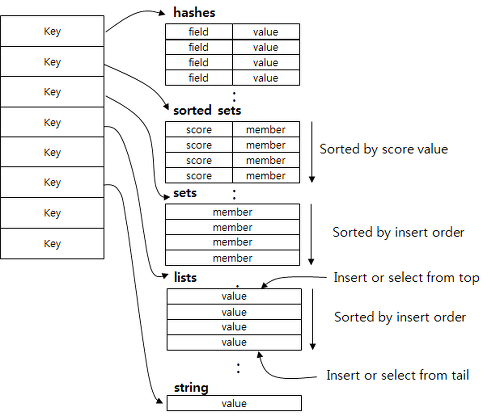
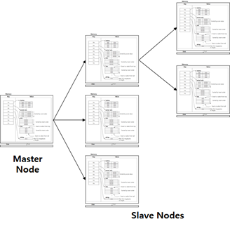
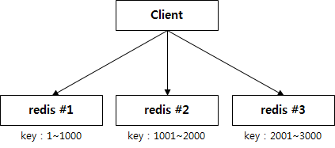
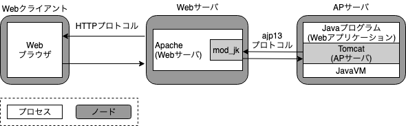
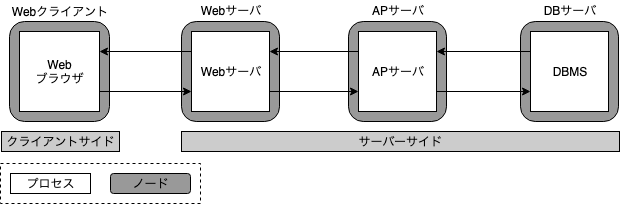

###### 인프라

1. 인프라
    - 어플리케이션이 움직이도록 하는 기반
    - 스펙과 가격에 따라 성능이 달라짐

2. AWS
    1. Route53
        - DNS 도메인 네이밍 서비스
        - IP로 접속하기 힘드니까 특정 네이밍으로 접속하면 해당하는 IP로 전환해서 접속        
    2. WAF
        - 방어벽
        - 외부의 공격을 감지하고 차단
    3. CloudFront
        - CDN(Contents Delivery Network)
        - 같은 액세스에 대해 매번 디비에 접속하지 않고, 클라우드 프론트를 보게 함으로써 디비의 부하를 줄임
        - 지역별로 클라우드 프론트 서버가 분산되어 있어, 어느곳에서 접속하더라도 해당 지역의 가장 가까운 클라우드로 서버로 접속하므로 속도면에서 우수
    4. S3
        - 스토리지 서비스
        - 간단하고, 정적인 컨텐츠를 올려놓고 사용
    5. CloudWatch
        - AWS의 태스크 매니져
        - AWS상에서 움직이고 있는 것들의 퍼센트, 접속자수, 부하 등을 표시
    6. SES
        - AWS의 이메일 서비스
        - SES를 이용하면 따로 이메일 서버를 세울 필요가 없음
        - 간단하여 이용 용이
    
3. VPC        
    1. Amazon Virtual Private Cloud
        - AWS 클라우드에서 논리적으로 격리된 공간을 프로비저닝하여 고객이 정의하는 가상 네트워크에서 AWS 리소스를 시작할 수 있음
        - 하나의 계정에서 생성하는 리소스들만의 격리된 네트워크를 만들어주는 기능이 바로 VPC
        - VPC를 사용하면 특정 사용자의 리소스들이 논리적으로 격리된 네트워크에서 생성되기 때문에 다른 사람들은 접근하는 것은 물론 보는 것도 불가능
        - VPC는 모든 사용자에게 강제적으로 적용
        - VPC 없이는 대부분의 서비스를 사용하는 것이 불가능
    2. Subnet
        1. Public Subnet
            - 외부에서 접속해서 보아도 되는 정보들
            - 예 : FO(Web), BO(Web, APP)
        2. Private Subnet
            - 외부에서 접속해서 보면 안되는 중요한 정보들
            - 예 : FO(APP), Redis, Index, ElasticSearch, DataBase
    3. EC2(Elastic Compute Cloud)
        - AWS에서 가장 중요한 서비스
        - 컴퓨터를 임대한다는 개념
        - 실제 컴퓨터를 통해 수행하는 작업들을 EC2를 통해 할 수 있음
        - 클릭 몇번으로 컴퓨터 한대를 설치할 수 있는것과 같음
        - 즉, 컴퓨터의 생성 및 삭제가 쉬움
        - 선호하는 OS, 웹서비스, 프로그램을 설치하면 됨
        - EC2를 통해 하는 가장 기본적인 업무는 웹서버 설치, 웹서버를 통해서 클라이언트가 브라우저를 통해서 요청하는 웹페이지, 이미지 등을 제공하는 것
        - 물리적으로 존재하는 것이 아니라, 인프라(데이터센터)에 만들어진 것이기 때문에 인터넷(네트워크)을 통해 제어함
        - 가상 컴퓨터를 사용할때 설치한 프로그램, 파일, 설정 등을 그대로 저장가능하며, 이를 이미지라고 함 -> 이 이미지가 AMI(Amazon Machine Image)
        - 가상 컴퓨터를 생성할때마다 반복적으로 설치하는 작업이 불필요
        1. 인스턴스
            - 가상 컴퓨팅 환경
            - 클라우드의 가상 서버
            - 1대의 컴퓨터를 의미하는 단위
            - 인스턴스 하나에 웹서버, mod_jk, 어플리케이션 서버가 하나씩 들어있음
        2. AMI
            - 아마존 머신 이미지
            - 소프트웨어 구성이 기재되어 있는 템플릿
            - 운영체제, 어플리케이션 서버, 어플리케이션 등등
            - 하나의 AMI로 여러 인스턴스를 실행할 수 있음
            - 서버에 필요한 운영체제와 여러 소프트웨어들이 적절히 구성된 상태로 제공되는 템플릿으로 인스턴스를 쉽게 만들 수 있음
        3. Auto Scaling Group(ASG)
            - EC2 인스턴스를 자동으로 생성하고 삭제해주는 서비스
            - 사용 목적 : 어플리케이션의 로드(부하)를 처리할 수 있는 정확한 수의 EC2 인스턴스를 보유하도록 보장함
            - 어플리케이션의 늘어나거나 줄어드는 수요에 따라 인스턴스를 시작하거나 종료할 수 있음
            - Auto Scaling Group에 최소, 최대 인스턴스수 지정 가능 
              Auto Scaling을 해도 그룹의 최대 인스턴스수를 넘지 않음
            - 모든 EC2 인스턴스가 Auto Scaling 그룹에 포함되는 것은 아님            
            - Auto Scaling을 하기 위해서는 자동으로 생성할 인스턴스를 만들어주어야 함
              인스턴스를 생성한 수에 필요한 소프트웨어 등을 설치하고 이를 이미지로 만들어 놓으면 Auto Scaling이 동작할 때 이 이미지를 인스턴스로 생성하게 됨
            - Auto Scaling 수명주기
                - Auto Scaling Group의 EC2 인스턴스는 다른 EC2 인스턴스와 달리 수명주기를 가짐
                - 수명주기 시작 : Auto Scaling Group이 인스턴스를 시작하고 서비스에 들어갈 때
                - 수명주기 종료 : 인스턴스를 종료하거나, Auto Scaling Group이 인스턴스를 서비스에서 제외시키고 이를 종료할 때 끝      
        4. ALB
            - Application Load Balancer
            - EC2 인스턴스 같은 여러 대상에 수신 어플리케이션 트래픽을 분산시킴
            - 어플리케이션의 가용성이 향상됨        
    
4. Redis
    1. 개념
        - REmote Dictionary Server
        - "Key-Value" 구조의 비정형 데이터를 저장하고 관리하기 위한 비관계형 데이터베이스 관리 시스템
        - 디스크가 아닌 메모리 기반의 데이터 저장소
        - 모든 데이터가 메모리에 저장됨
            -> read/write 속도가 빠름
            -> 물리적인 메모리 크기를 넘어설 수 없음
        - 데이터 액세스는 메모리에서 일어나지만, 서버가 멈추는 상황에 대비하여 데이터를 디스크에도 보존
        - "Key-Value" 구조 -> PUT/GET 기능 지원
        
    2. 사용 사례 
        1. Caching(Data)
            - PC에서 메모리의 개념
            - 메모리는 휘발성 데이터를 빠르게 찾고 부르기 위해 사용하는데, 레디스가 그 경우
            - 반대로, DB는 하드디스크의 개념 -> 영구적인 데이터를 보존하는데 사용하고, 속도가 느림
        2. Session
            - 예를들어 프론트 웹서버가 여러대일 경우 한곳에만 세션 정보를 저장하면 한쪽이 멈춘경우, 세션의 지속이 불가능한데, 
            레디스 세션에 저장해 놓으면 해당 세션에 대한 정보를 언제나 유지하기 때문에 세션지속이 가능하다. 
                -> 즉, 복수 서버 환경에서 세션 정보 공유 가능
        3. 채팅 및 메시징
            - PUB/SUB 표준 지원
        
    3. 사용가능한 데이터형
        - String뿐만 아니라, Lists, Sets, Hashes등의 집합형 데이터도 지원
        - 저장된 데이터에 대해 연산 등 추가 작업 가능
        
        1. String
            일반적인 문자열
            최대 512mbyte까지 지원
        2. Lists
            String들의 집합
            저장되는 데이터형태는 set과 유사하지만 방향이 있음
            List 앞과 뒤에서 PUSH/POP 연산을 이용해서 데이터를 넣거나 뺄수 있음
            인덱스값을 이용해서 지정된 위치에 값을 넣을 수 있음
        3. Sets
            String의 집합
            여러개의 값을 하나의 value에 넣을 수 있음
            set간의 연산을 지원(합집합, 교집합, Difference)
        4. Sorted sets
            set에 score라는 필드가 추가된 데이터형
            score는 가중치를 의미
            오름차순으로 내부정렬됨
        5. Hashs                
            value내에 field/string이 쌍으로 이루어진 테이블을 저장하는 데이터 구조
    
    4. 데이터 보존
        - 레디스는 메모리에 저장된 데이터에 액세스해서 빠른 속도를 낼 수 있지만, 
            서버 shutdown에 대비하여 disk에도 데이터를 저장해 놓음
            shutdown시에 디스크의 데이터를 읽어서 메모리에 loading하기 때문에 데이터 유실을 방지함
        - 데이터 보존은 disk에 데이터를 저장하는 방식
        1. snapshotting방식 
            - 순간적으로 메모리에 있는 내용 전체를 디스크에 옮겨 담는 방식
            1. 장단점
                - 장점 : 메모리의 스냅샷을 그대로 저장하기 때문에 서버 재기동시 스냅샷만 로드하면 되므로 재기동 시간이 빠름
                - 단점 : 스냅샷을 추출하는 시간이 오래걸림
                        스냅샷 추출 후 서버가 내려가면 스냅샷 이후의 데이터는 유실됨 (백업 시점의 데이터까지만 유지되니까)
            2. 방식
                1. SAVE
                    레디스의 모든 동작을 정지시키고 그때의 스냅샷을 디스크에 저장
                2. BGSAVE    
                    별도의 프로세스를 띄운 후, 명령어 수행 당시의 메모리 스냅샷을 디스크에 저장
                    따라서 저장 순간에도 레디스가 정지되지 않고 정상 작동됨
        2. AOF방식
            - 레디스의 모든 read/write 연산을 로그파일에 기록하는 방식
            서버가 재시작될때 기록된 read/write 연산을 순차적으로 재실행하여 데이터를 복구함
            따라서 특정 시점이 아니라 항상 현재 시점까지이 로그를 기록 가능 
            1. 장단점
                - 장점 : 로그 파일에 대해서만 append하기 때문에 속도가 빠르고 어느 시점에서 서버가 다운 되더라도 데이터 유실이 발생하지 않음
                - 단점 : 모든 read/write에 대해서 기록을 남기기 때문에 로그 데이터양이 방대함
                        복구 시 저장된 read/write 연산을 다시 실행하기 때문에 재기동 속도가 느림
        3. 권장
            - 결과적으로 두 방법 다 장단점이 있기 때문에 둘을 혼용해서 사용하는 것을 권장함
            - 주기적으로 스냅샷으로 백업하고, 다음 스냅샷까지의 저장을 AOF방식으로 수행
            
    5. Replication
        1. Master/Slave Replication
            
            - master 노드의 내용을 slave노드에 복제하는 것
            - 1개의 master 노드는 N개의 slave 노드를 가질 수 있음
            - slave 노드도 자신에 대한 slave 노드를 가질 수 있음
            - master/slave 간의 복제는 Non-blocking 상태로 이루어짐 -> 데이터 불일치 가능성 있음
        2. Query Off Loading을 통한 성능 향상
            - Query Off Loading
              master node = write only
              slave node = read only
        3. sharding
            - 여러대의 레디스 서버를 구성한 후, 데이터를 일정 구역별로 나누어서 저장하는 것     
            ex) key 번호 별로 구역을 나누어 저장
            
    
    6. Expiration
        -  레디스는 데이터에 생명주기를 정해서 일정 시간 경과시 자동 삭제 가능
        1. 방식
            - Active 방식 : 클라이언트가 Expire된 데이터에 접근하려고 하면 그 때 지우는 것
            - Passive 방식 : 주기적으로 키들을 랜덤으로 100개만 스캔해서 지우는 것
            - Active의 경우 접근한 데이터만, Passive의 경우 랜덤으로 스캔된 데이터만 지우기 때문에
            전체를 스캔하는 것이 아니라서 expired 되었으나 지워지지 않는 데이터가 존재 가능    
            
    7. SpringBoot에 Redis CacheServer 설정
        - 의존성 라이브러리 추가
        - Redis 서버 정보 설정
        - 스프링부트에 캐시 사용 여부 알리기
        - 사용할 서비스 메소드에 어노테이션 추가
            - 캐시 추가 : 
                @Cacheable 캐시가 있으면 캐시 정보 가져오고, 없으면 등록
                @CachePut  무조건 캐시에 등록
            - 캐시 삭제 : @CacheEvict
            
    8. Redis 명령어
        - set : 데이터 저장
        - get : 데이터 검색
        - rename : key값 변경
        - keys : 저장된 모든 key 검색 -> 부하가 심해서 사용 X
        - randomkey : 저장된 key 중에 하나의 랜덤한 key 검색
        - exists : 검색하려는 key 존재여부 확인
        - strlen : 검색하려는 key의 value 확인
        - flushall : 저장되어 있는 모든 key 삭제
        - setex : 데이터를 입력할때  일정 시간이 지나 자동으로 삭제하는 명령
        - mget/mset : 여러개의 키/value를 검색, 저장할 때
        - append : 현재 value 값에 value를 덧붙여서 추가할 때
        - incr/decr : 특정 key 값의 value 값에 대한 증가 또는 감소 값을 가져올 때
        - save : 현재 입력되어 있는 key/value를 파일로 저장할 때
        
    9. Redis 프로그램
        - redis-server : 레디스 서버
        - redis-cli : 레디스 CLI 인터페이스
        - redis-sentinel : 레디스 모니터링 툴
        - redis-benchmark : 레디스의 성능 테스트를 위한 벤치마킹 툴
        - redis-check-aof : 데이터 파일 손상 확인
        
    10. Sentinel
        레디스는 마스터와 복제로 구성되어서, 마스터가 다운되면 관리자가 이를 감지해서 복제를 마스터로 올림
        센티널은 마스터와 복제를 감시하고 있다가 마스터가 다운되면 이를 감지해서 관리자의 개입없이 자동으로 복제를 마스터로 올려줌
            
> Reference
> Redis : https://bcho.tistory.com/654        
> SpringBoot에 Redis CacheServer 설정 : https://yonguri.tistory.com/82
> Redis 프로그램 : https://nachwon.github.io/redis/
> Redis 명령어 : https://sqlmvp.tistory.com/1313
> Sentinel : http://redisgate.jp/redis/sentinel/sentinel.php

5. ElasticSearch
    1. 검색엔진
        - 단어 검색에 최적화 되어 있음
        - SELECT문으로 데이터베이스에 직접 해당 단어를 구간별로 끊어서 검색할 경우, 속도도 느리고 검색 결과도 정확하지 않음
        - 따라서 그 대안으로 제시된 것이 엘라스틱 서치
        - 엘라스틱 서치는 검색어를 입력하면 해당 단어 혹은 문장에 해당하는 검색 결과를 내보내줌
        - 검색결과는 일련번호와 같은 키 정보로 상품이나, 전시 정보를 들고 있지는 않음
        - 엘라스틱서치가 내보낸 일련번호로 레디스 데이터에서 해당하는 상품을 찾아서 조회
        - 만약 레디스에 일련번호에 해당하는 정보가 없다면 그때, 데이터베이스로 가서 조회

6. Index
    - BO나 FO에서 INPUT 동작이 있을 경우, 데이터베이스의 데이터에 변화가 생김
    - 인덱스틑 이러한 데이터베이스의 변동을 감지해서 이 변화에 해당하는 부분만을 레디스와 엘라스틱 서치에 반영함
    - 즉, DB와의 사이에서 발생하는 사분을 감지하고 넣는 역할
    
    
    
* 출처
- https://docs.aws.amazon.com/ko_kr/vpc/latest/userguide/what-is-amazon-vpc.html
- https://www.44bits.io/ko/post/understanding_aws_vpc
- ALB : https://docs.aws.amazon.com/ko_kr/elasticloadbalancing/latest/application/introduction.html
- ALB : https://docs.aws.amazon.com/ko_kr/elasticloadbalancing/latest/application/application-load-balancers.html
  
-----------------------------------------------------------------------------------------------------------------------
###### 접속경로

1. 접속경로
    1. Route53
        1. EndUser
        2. IP 제한 유저
    2. VPN
        1. 개발자, 고객사
        2. Route53를 통하지 않고 VPC안으로 바로 접속할 수 있음

        
-----------------------------------------------------------------------------------------------------------------------
###### 미들웨어

1. Web 어플리케이션 구성
    - 웹서버               -> Apache
    - 데이터베이스 서버    -> Postgre
    - 어플리케이션 서버    -> Tomcat
    - 웹클라이언트(웹브라우저) <--HTTP--> 웹서버(Apache) <--AJP(mod_jk)--> AP서버(Tomcat) <-> DB서버(DBMS : PostgreSQL)
    
    
    - FO(Web), FO(API), BO(Web, APP), Batch서버는 모두 각각의 웹서버(Apache), AP서버(Tomcat)을 가짐
    
    
    
2. Web 서버
    1. 역활
        - 클라이언트에서 요청(HTTP Request)이 올때 가장 앞에서 요청에 대한 처리를 함
        - 정적컨텐츠를 요청 받으면 Web서버가 응답(HTTP Response)
        - 동적컨텐츠를 요청 받으면 웹서버가 처리해주지 못하기 때문에 WAS로 요청을 넘김
    2. 예
        - Apache
            - 특징
            - httpd
        - nginx
    
3. WAS(Web Application Server)
    1. 역할
        - 동적컨텐츠를 제공하기 위해 만들어진 서버
        - 데이터베이스 조회나, 로직처리가 있을경우 사용됨
        - 웹서버로부터 요청이오면 받아서 처리함
    2. 예
        - Tomcat -> 아파치의 기능을 일부 포함하고 있어서 웹서버 기능이 일부 가능
        - Jeus
        - JBoss

4. mod_jk
    1. 정의
        - AJP(Apache JServ Protocol, 아파치가 웹서버와 톰캣과 같은 외부서비스를 연동하기 위해 정한 규약)을 사용하여 
        Tomcat서블릿 컨테이너를 Apache, iPlant, Sun ONE, IIS와 같은 웹서버와 연결하는데 사용되는 Apache 모듈
        - 아파치와 톰캣을 연결하는 방식 중 가장 많이 사용되기 때문에 관련 자료가 많음
            - 아파치와 톰캣을 연결하는 방식들
                - mod_jk
                - mod_proxy
                - mod_proxy_ajp
        - JkMount 옵션을 이용하여 URL이나 컨텐츠별로 유연한 설정이 가능함
        - 하지만, 별도의 모듈을 설치해야하고 
        - 설정이 어려우며
        - 톰캣에 한정된다는 것이 단점임

5. 로드밸런서
    1. 정의
        - 부하분산
        - 둘 혹은 셋 이상의 중앙처리장치 혹은 저장장치와 같은 컴퓨터 자원들에게 작업을 나누는 것을 의미
        - 가용성 및 응답시간을 최적화
        - 클라이언트와 서버사이에 위치하여 한대의 서버로 부하기 집중되지 않도록 트래픽을 관리하여 최적의 퍼포먼스를 보여줌
    2. 역할
        1.부하분산
            1. Scale-Out/Scale-in
                1. Scale-Out
                    - 기존 서버와 동일하거나 비슷한 성능의 서버의 대수를 늘리는 것
                    - CPU i3를 기존 1대에서 4대로 늘리는 것
                2. Scale-in
                    - 서버 대수 줄임
            2. Scale-up/Scale-down
                1. Scale-Up
                    - 서버 자체의 성능을 확장
                    - CPU i3를 i7으로 확장하는 것과 비슷
                2. Scale-down
                    - 성능 줄이는 것        
        2. SSL(암호화/복호화)
    3. 스케줄링 방식
        1. Round Robin
            - 단순히 순서에따라 돌아가며 분배
        2. Least Connections
            - 연결 개수가 가장 적은 서버에 분배
            - 트래픽으로 세션이 길어지는 경우 권장
        3. Source    
            - 사용자의 IP를 Hashing하여 분배
            - 사용자가 항상 같은 서버로 연결되는 것이 보장됨

* 출처
- 서버 : https://qiita.com/tamago3keran/items/f470593926458b7ef52a
- https://jeong-pro.tistory.com/84
- https://www.lesstif.com/pages/viewpage.action?pageId=12943367
- 로드밸런스 : https://post.naver.com/viewer/postView.nhn?volumeNo=27046347&memberNo=2521903
- 로드밸런스 스케줄링 방식 : https://nesoy.github.io/articles/2018-06/Load-Balancer
- EC2 : https://codingmania.tistory.com/15
- EC2 : https://docs.aws.amazon.com/ko_kr/AWSEC2/latest/UserGuide/concepts.html

-----------------------------------------------------------------------------------------------------------------------
###### CI

1. CI
    1. 정의
        - 지속적 통합
        - 지속적으로 퀄리티 컨트롤을 적용하는 프로세스를 실행하는 것
        - 소프트웨어 개발 프로젝트는 [분석/설계] → [코드 작성] → [빌드] → [테스트] → [릴리스] → [디플로이]의 생명주기를 가짐
        - 위의 단계들이 반복적으로 이루어지는데 예전에는 이 과정에서 복잡성 및 시간 소요로 통합이 드물게 이루어졌음
        - 이러한 문제를 해결하기 위해 팀원들이 작성한 코드를 최대한 자주 통합하는 소프트웨어 개발 실천법이 지속적인 통합임                        
        - Compile
            - 컴퓨터가 이해하는 기계어로 변환하는 작업 즉, 바이너리 코드로 변환
            - 이러한 작업을 하는 것을 컴파일러
            - 자바의 경우 컴파일러가 바이트코드 형태의 클래스 파일을 생성하면 JVM에서 실행
            - 컴파일은 해당 파일만을 컴파일해서 object 파일을 생성
        - Build
            - 소스코드 파일을 실행가능한 소프트웨어 산출물로 만드는 일련의 과정을 말함
            - 빌드 안에 컴파일이 포함되어 있음
            - 자바의 경우 war, jar 파일을 만드는 것
            - 빌드는 관련된 모든 파일을 컴파일해서 object 파일을 만든 뒤, link를 해서 실행가능한 exe/bpl/bpk 등의 파일을 생성
            - Compile + 그 외 작업
            - 빌드툴은 전처리(preprocessing), 컴파일(Compile), 패키징(packaging), 테스팅(testing), 배포(distribution)를 제공함
            - 빌드툴 종류 Ant, Maven, Gradle
        - Run  = Bulid + 실행
               = (Compile + 그 외 작업) + 실행     
        - release
        - deploy                
            - 빌드되어 실행가능한 결과물을 컨테이너에서 인식가능한 곳에 배치하는 것
        
    2. CI서버
        - 빌드 프로세스를 관리하는 서버
        - Jenkins, Hudson, CruiseControl.NET, TeamCity
        - Jenkins가 가장 많이 사용됨
        - Jenkins
    
    3. SCM
        - 소스코드 형상관리 시스템
        - 소스코드의 개정과 백업 절차를 자동화하여 오류 수정 과정을 도와줌
        - Git, SVN, Mercurial
        - Git 호스팅 서비스
            - GitHub
            - GitLab
            - Bitbucket
        
    4. Build Tool
        - 컴파일, 테스트, 정적분석 등을 실시해 동작 가능한 소프트웨어를 생성
        - ANT, Maven, Gradle 
    
    5. 라이브러리 관리
        - Nexus    
        
    6. Docker
        - 리눅스의 응용프로그램들을 소프트웨어 컨테이너 안에 배치시키는 일을 자동화하는 오픈소스 프로젝트

*출처
- 도커 https://subicura.com/2017/01/19/docker-guide-for-beginners-1.html
- https://tenlie10.tistory.com/75

-----------------------------------------------------------------------------------------------------------------------
###### OS
1. OS
    1. 정의
        - Operating System
        - 운영체제
    2. 종류
        1. Window
            - MS개발
            - 마우스로 클릭이 가능한 그래픽 유저 인터페이스 지원
            - 편의성이 탁월하여 전세계 90%가 사용
        2. Unix
            - 미국 벨연구소 개발
            - 다중 사용자/ 다중 태스크 실행 지원
            - 대화형 운영체제
            - 전산용으로 적합
        3. Linux
            - Unix기반의 공개용 OS
            - 무료
            - 종류
                - redhat계열 -> 페도라, 센토스
                - 데비안 계열 -> 우분투(Ubuntu)
          
                

*출처
- https://coding-factory.tistory.com/318

-----------------------------------------------------------------------------------------------------------------------
###### 기타

1. Caching
    1. Cache란
        - 한번 읽은 데이터를 임시로 저장하고 필요에 따라 전송, 갱신, 삭제하는 기술
        - 서버의 메모리에 저장하는 경우가 많음 -> 디스크에 저장하는 경우보다 훨씬 빠름
        - 메모리에 저장하기 때문에 서버가 다운되면 사라지는 휘발성을 지님
        - 임시로 보관하여 빠르게 읽을 데이터에 적합
    2. 사용 목적
        - 서버간 불필요한 트래픽 감소시키기
        - WAS서버 부하 감소시키기
        - 빠른 처리로 성능 확보
    3. Caching 대상 정보
        - 단순한함
        - 반복적임
        - 정보의 변경이 빈번하지 않음
        - 단위처리 시간이 오래걸림
        - 정보의 최신화가 실시간으로 이루어지지 않아도 됨
    4. Cache 사용시 주의점
        - 캐싱할 정보의 선택
        - 캐싱할 정보의 유효기간
        - 캐싱한 정보의 갱신시점
    5. SpringBoot가 공식지원하는 ThirdParty 캐싱 라이브러리
        - Redis
        - Caffeine
        - EhCache
        - Hazelcate
        - Infinispan
    
        
> Reference
> Redis CacheServer설정 https://yonguri.tistory.com/82